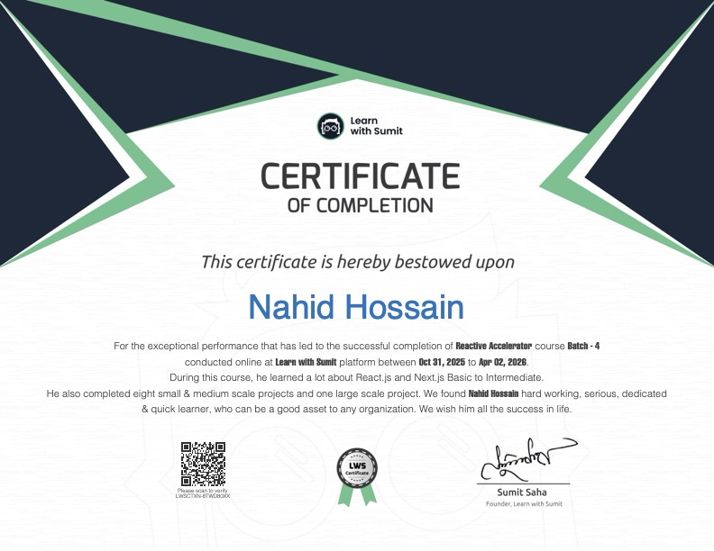
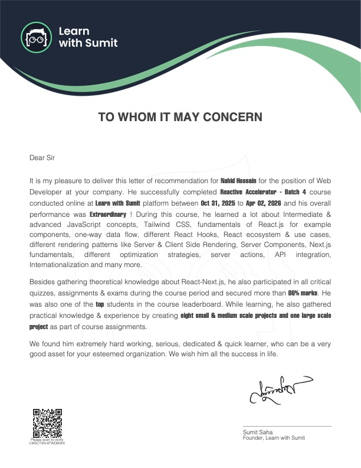

<h1 align="center">
  
</h1>

  <strong>Software QA Engineer • Frontend Expertise</strong>

  

---

## 👨‍💻 About Me

Welcome to my GitHub profile! I'm a **Software QA Engineer with strong Frontend Expertise**.

I specialize in ensuring **software quality, reliability, and performance** through structured testing strategies and close collaboration with engineering teams. My frontend background helps me understand application architecture deeply and identify issues early in the development lifecycle.

I primarily work with **JavaScript, React, and Next.js**, focusing on testing modern web applications and delivering stable, high-quality user experiences.

I’m passionate about:

🔍 Identifying bugs before they reach users  
🧪 Improving product reliability through automated testing  
⚡ Optimizing UI performance and frontend quality  
🎯 Delivering smooth and user-friendly digital experiences  

---

## 💫 Engineering Focus

### 🧪 Quality Engineering

🔎 Ensuring application reliability through **manual and automated testing**  
🧪 Experienced with testing tools such as **Vitest, Jest, and Mocha**  
📊 Writing structured **test cases, bug reports, and validation flows**  
🤝 Collaborating with engineering teams to deliver stable releases  

### ⚛️ Frontend Expertise

⚛️ Strong experience with **React and Next.js**  
⚡ Focused on **UI reliability, performance, and maintainable architecture**  
🎯 Improving product quality through **testing and engineering insight**  
🌱 Continuously learning modern tools and best practices  

---

## 🌐 Socials

---

## 💻 Tech Stack

| 🧠 Languages | ⚛️ Frameworks & Libraries | 🧪 Testing | 🛠 Tools | 🗄 Databases |
|-------------|--------------------------|------------|---------|-------------|
|     |     |    |     |    |

---

## 🎓 Certificates

| Certificate | Description |
|------------|-------------|
| 
 **LWS Certificate of Achievement**
  | **Reactive Accelerator Course Completion** Successfully completed comprehensive web development training covering modern frontend technologies, best practices, and industry standards. |
| 
 **LWS Letter of Recommendation**
  | **Professional Recommendation** Recognized for dedication, technical proficiency, and collaborative spirit throughout the training program. Endorsed for strong problem-solving abilities and commitment to excellence. |

---

## 📊 GitHub Stats

---

### 🔝 Top Contributed Repository

---

