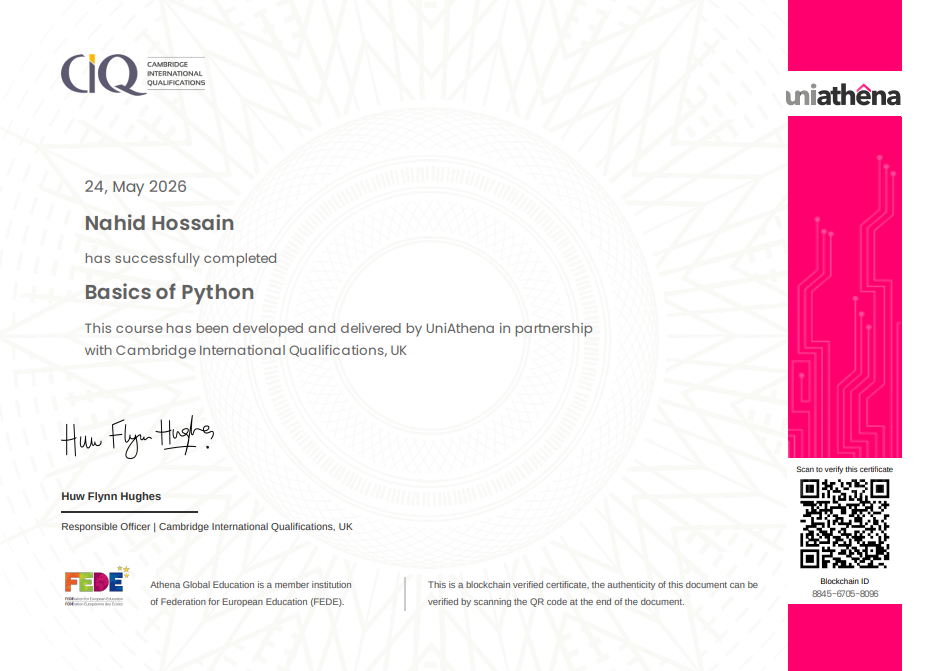

<h1 align="center">
  
</h1>

  <strong style="color:#F98B00;">Full-Stack Developer • React.js, Next.js & Node.js</strong>

  

---

## 👨‍💻 About Me

Welcome to my GitHub profile! I'm a **Full-Stack Developer with strong Frontend expertise**.

I specialize in building **scalable, high-performance web applications** using modern technologies like **HTML, CSS, JavaScript, TypeScript, React.js, Next.js, and Node.js**. My focus is on delivering clean, maintainable, and user-friendly digital experiences.

With a strong understanding of **client-side and server-side development**, I work across the full stack to develop robust applications, integrate APIs, and optimize performance and scalability.

I’m passionate about:

⚡ Building scalable web applications  
🧩 Creating reusable and efficient UI components  
🔗 Designing and integrating APIs  
🚀 Improving performance and user experience  

---

## 💫 Engineering Focus

### ⚛️ Frontend Development

🔎 Building modern interfaces using **HTML, CSS, React.js, and Next.js**  
🧩 Developing reusable and scalable component architecture  
⚡ Optimizing UI performance and responsiveness  
🎯 Writing clean and maintainable frontend code  

### 🚀 Backend Development

⚙️ Developing backend services using **Node.js & Express.js**  
🔗 Building and integrating **RESTful APIs**  
🗄 Working with databases like **MongoDB, MySQL, Supabase, and Prisma**  
🔐 Implementing authentication using **JWT & Firebase**  

---

## 🌐 Socials

---

## 💻 Tech Stack

| 🧠 Languages | ⚛️ Frontend | 🚀 Backend | 🧪 Testing | 🛠 Tools | 🗄 Databases |
|-------------|-------------|------------|------------|----------|-------------|
|     |     |    |    |     |      |

---

## 🎓 Certificates

| Certificate | Description |
|------------|-------------|
| 
 **Certificate of Achievement**
  | **Reactive Accelerator Course Completion** Completed a structured training program focused on modern web development practices, including frontend and backend fundamentals, component-based architecture, API integration, and performance optimization techniques for building real-world applications. |
| 
 **Recommendation Letter**
  | **Professional Performance Recognition** Recognized for strong technical understanding, problem-solving ability, and consistent performance throughout the training program. Demonstrated effective collaboration, adaptability, and attention to detail while working on development-focused tasks. |
| 
 **Python Fundamentals Certificate**
  | **Programming Fundamentals in Python** Completed foundational training in Python programming, covering core concepts such as variables, loops, functions, and problem-solving approaches. Strengthened logical thinking and coding fundamentals essential for software development. |

---

## 📊 GitHub Stats

---

### 🔝 Top Contributed Repository

---

